# Main Implementation
main.ipynb contains the code for the main implementations and performance comparisons. main.m contains the MATLAB implementations, but because it is in a different language, the results have been stored manually in the python notebook in order to generate the plots. Running main.ipynb on Google Colab with a single-core CPU environment yields the following results:

## Matrix Multiplication
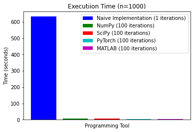
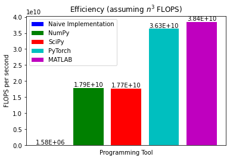

## Matrix-Vector Product
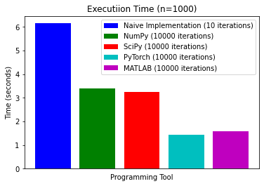
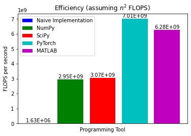

## Dot Product
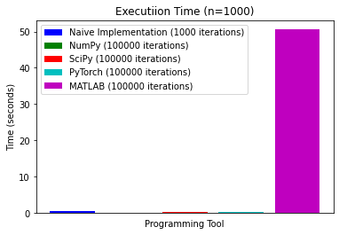
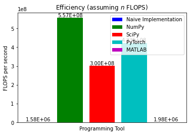

## Element-wise Operations
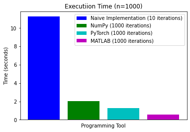
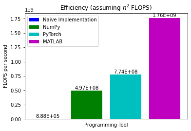

## LU Decomposition
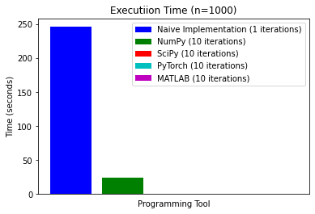
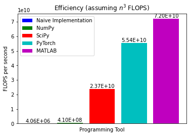

## QR Decomposition
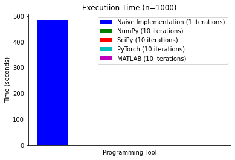
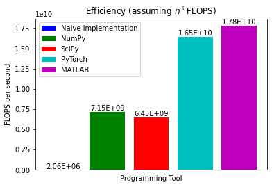

## Eigen Decomposition
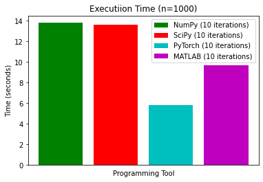
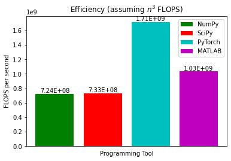

# SOTA
## Jax
jax.ipynb contains the comparisons between NumPy/SciPy (CPU) and Google Jax (TPU). This must also be ran on Google Colab, using a TPU environment. The times for each library will be output by the notebook, the Jax implementations should be faster by approximately the following:
- LU Decomposition: 14x Faster
- QR Decomposition: 56x Faster
- Matrix Multiplication: 604x Faster
- Element-wise Operations: 2x Faster

## BLAS/LAPACK
To demonstrate how BLAS/LAPACK allow automatic utilization of hardware, np_test.py profiles NumPy's matrix multiplication using either a single or multiple cores. To run on a single core, call ```python np_test.py single```. To run on as many cores as your CPU has available, call ```python np_test.py```. Because Colab CPU's only have a single core available, this file is separate and needs to be run on a multi-core device to see an actual difference. Results will vary depending on the number of cores, on an 8-core Macbook Pro M1, the script outputs the following results:
```
Profiling NumPy with Multi CPU Cores
Matrix Multiplication Time: 2.994995355606079 seconds
```
```
Profiling NumPy with a Single CPU Core
Matrix Multiplication Time: 10.066521883010864 seconds
```